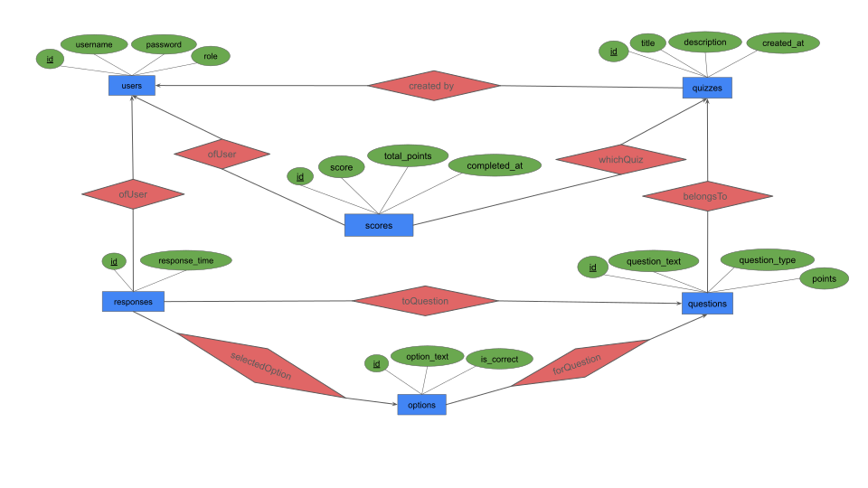

# Quiz Construction System

A comprehensive quiz management system built with Python, Tkinter, and SQLite. Features role-based access control, SQL transactions for data integrity, and a modern GUI interface.

## Data Model

### E/R Diagram



### E/R Model
* Users(<u>id</u>, username, password, role)
* Quizzes(<u>id</u>, title, description, created_by, created_at)
* Questions(<u>id</u>, quiz_id, question_text, question_type, points)
* Options(<u>id</u>, question_id, option_text, is_correct)
* Responses(<u>id</u>, user_id, question_id, selected_option_id, response_time)
* Scores(<u>id</u>, user_id, quiz_id, score, total_points, completed_at)

### Relational Model (3NF)

The database is normalized to **Third Normal Form (3NF)**:

1. **First Normal Form (1NF)**: All attributes are atomic
2. **Second Normal Form (2NF)**: All non-key attributes are fully functionally dependent on the primary key
3. **Third Normal Form (3NF)**: No transitive dependencies exist


**Referential Integrity:**
- Foreign keys enforce relationships between tables
- CASCADE deletes maintain consistency (deleting a quiz automatically deletes its questions and options)
- CHECK constraints validate data types and values

## SQL Transactions

The system uses SQL transactions extensively to ensure data integrity:

- **Isolation Level**: IMMEDIATE - Acquires write locks immediately to prevent deadlocks and allow concurrent reads
- **Atomic Operations**: Question creation with options, quiz responses saving, and demo quiz creation are all atomic
- **Rollback on Errors**: All write operations use try/except blocks with rollback on failure
- **Data Consistency**: Transactions ensure that related data is saved together or not at all

Key transaction methods:
- `save_question_with_options()`: Atomically saves question and all its options
- `save_all_responses()`: Atomically saves all user responses for a quiz
- `create_demo_quizzes()`: Creates complete demo quizzes with all questions and options in one transaction

## Installation and Usage

### Requirements

- Python 3.7+
- tkinter (usually included with Python)
- SQLite3 (included with Python)

### Running the Application

```bash
python main.py
```

### Default Credentials

- **Admin**: username: `admin`, password: `admin`
- Regular users can register through the login window

### Features

**Administrator Features:**
- Create, edit, and delete quizzes
- Add questions to quizzes (single choice or multiple choice)
- Add answer options for each question with correct/incorrect marking
- Set points per question
- Create demo quizzes with sample data
- View all quizzes sorted alphabetically
- Sign out to switch accounts

**User Features:**
- View available quizzes
- Take quizzes with question navigation
- Submit quizzes and receive immediate scores
- View score history with percentage grades
- Sign out to switch accounts

## Architecture

The application follows a layered architecture:

1. **UI Layer**: Tkinter windows for user interaction
2. **Business Logic Layer**: Window classes handle UI logic and user interactions
3. **Data Access Layer**: Database class manages all SQL operations
4. **Database Layer**: SQLite database with normalized schema

## Score Calculation

- **Single Choice Questions**: User must select the one correct option to earn points
- **Multiple Choice Questions**: User must select exactly all correct options (no more, no less) to earn points
- Final score is the sum of points earned across all questions

